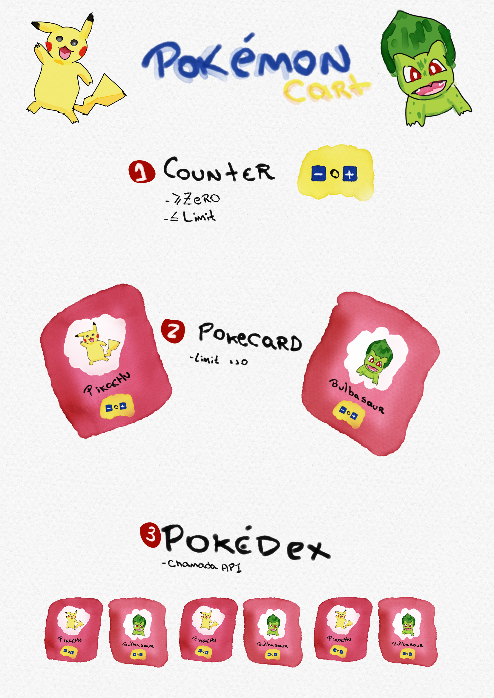

# Dojo Testing Strategy With React



## Setup

```bash
yarn
cd visual-tests
yarn
```

## Running tests

### Unit tests

```bash
yarn test
```

### Visual Regression tests

```bash
yarn visual-test
```

The command above will `start` storybook, `run` visual tests and `stop` storybook.

### Visual Regression tests During development

If you are developing visual tests it may be faster to do not `start` and `stop` storybook every time.

In this scenario, starts storybook:

```bash
yarn storybook
```

and run visual tests individually:

```bash
yarn --cwd visual-tests test
```

or

```bash
cd visual-tests
yarn test
```